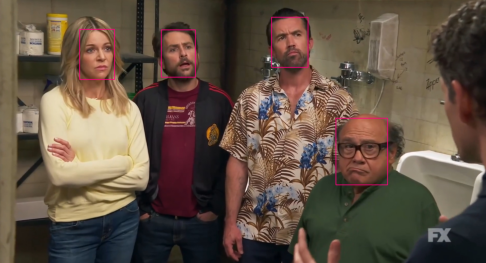

### ***Face Recognizer Program***  

The first program (which is included in this too, FACE.py) uses Haar Cascade Classifier  
which can work better with multiple faces but doesn't work great if the faces aren't easily seen.

This second one works by using Single Shot MultiBox Detector (SSD)
which is a classifier that has great perfomance but still, compared to others
like FaceNet, is not that reliable.  

That being said many faces might end up being not recognized, so take this
in consideration.

### ***If you want to test it***  
You'll need these packages:  
* *OpenCV: pip install opencv-python*  
* *NumPy: pip install numpy*
* *MatplotLib: pip install matplotlib*

or just: *pip install opencv-python numpy matplotlib*

### ***To run***
* *git clone https://github.com/benaytms/faces_recognizer2.git*
* *cd faces_recognizer2*
* CHECK THE COMMENTS ON FACE.sh FILE TO SEE HOW TO SAVE THE IMAGES YOU WANT TO TEST
* chmod +x FACE.sh
* ./FACE.sh

As i said earlier, it's not perfect, so don't worry if some faces don't get recognize.  
Should work fine in most cases though.

### ***Acknowledgments***

This project uses the Single Shot MultiBox Detector (SSD) algorithm for face detection. The SSD algorithm is described in the following paper:

- Liu, W., Anguelov, D., Erhan, D., Szegedy, C., & Tyagi, A. (2016). SSD: Single Shot MultiBox Detector. In European Conference on Computer Vision (ECCV).

For more details, refer to the [original paper](https://arxiv.org/abs/1512.02325) and the [Caffe model repository](https://github.com/weiliu89/caffe/tree/ssd).
