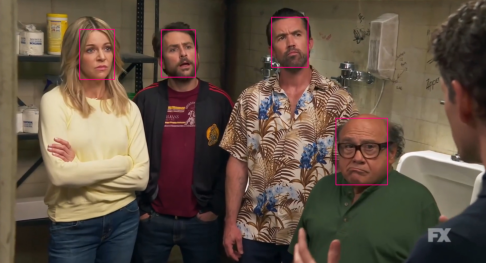

### ***Face Recognizer Program***  

*Face recognition algorithm made with in Python with OpenCV package*

### ***If you want to test it***  
You'll need these packages:  
* *OpenCV: pip install opencv-python*  
* *NumPy: pip install numpy*
* *MatplotLib: pip install matplotlib*

or just: *pip install opencv-python numpy matplotlib*

#### *note*
* images must be png, jpg, jpeg or webp

### ***To run***
* *git clone https://github.com/benaytms/faces_recognizer2.git*
* *cd faces_recognizer2*
* ***place the images you want to use inside the 'files' folder***
* chmod +x FACE.sh
* ./FACE.sh

### ***Acknowledgments***

This project uses the Single Shot MultiBox Detector (SSD) algorithm for face detection. The SSD algorithm is described in the following paper:

- Liu, W., Anguelov, D., Erhan, D., Szegedy, C., & Tyagi, A. (2016). SSD: Single Shot MultiBox Detector. In European Conference on Computer Vision (ECCV).

For more details, refer to the [original paper](https://arxiv.org/abs/1512.02325) and the [Caffe model repository](https://github.com/weiliu89/caffe/tree/ssd).
